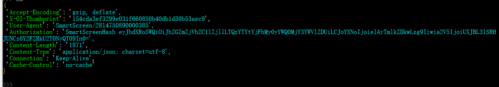
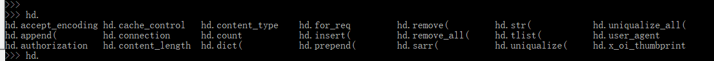

# nvhead
>__http headers APIs__

# install
>__pip3 install nvhead__

# SUMMARY
-----------------------------------------------------------------------

    from xdict.jprint import pobj
    from xdict.jprint import pdir
    import nvhead.head as nvhd

    req_head_s = '''Accept-Encoding: gzip, deflate
    X-OI-Thumbprint: 154cda3ef3299e031f660850b40db1d30b53aec9
    User-Agent: SmartScreen/2814750890000385
    Authorization: SmartScreenHash eyJhdXRoSWQiOiJhZGZmZjVhZC1lZjllLTQzYTYtYjFhMy0yYWQ0MjY3YWVlZDUiLCJoYXNoIjoielAyTmlkZDkwLzg9Iiwia2V5IjoiUXJBL3lSRHJUNCs0Y2FZRkU2T0NyQT09In0=
    Content-Length: 1871
    Content-Type: application/json; charset=utf-8
    Connection: Keep-Alive
    Cache-Control: no-cache'''
    
    hd =nvhd.Head(req_head_s)
    hd    
   

    hd.
   

    hd.count
    hd.for_req
    hd.for_res
    
    hd.accept_encoding
    hd.x_oi_thumbprint
    hd.user_agent
    hd.authorization
    hd.content_length
    hd.content_type
    hd.connection
    hd.cache_control

-----------------------------------------------------------------------

_class Head_  
-------------------------------------------------------------------------
>├──0. [init with string](nvhead/Images/Head.init_with_string.0.png)   
├──1. [init with dict\<0\>](nvhead/Images/Head.init_with_dict.0.png)   
├──1. [init with dict\<1\>](nvhead/Images/Head.init_with_dict.1.png)   
├──1. [init with dict\<2\>](nvhead/Images/Head.init_with_dict.0.png)   
├──2. [init with tlist\<0\>](nvhead/Images/Head.init_with_tlist.0.png)   
├──2. [init with tlist\<1\>](nvhead/Images/Head.init_with_tlist.1.png)   
├──3. [init with res_head\<0\>](nvhead/Images/Head.init_with_res_head.0.png)   
├──4. [append\<0\>](nvhead/Images/Head.append.0.png)   
├──4. [append\<1\>](nvhead/Images/Head.append.1.png)   
├──4. [append\<2\>](nvhead/Images/Head.append.2.png)   
├──4. [append\<3\>](nvhead/Images/Head.append.3.png)   
├──5. [remove\<0\>](nvhead/Images/Head.remove.0.png)   
├──5. [remove\<1\>](nvhead/Images/Head.remove.1.png)   
├──6. [remove_all](nvhead/Images/Head.remove_all.0.png)   
├──7. [prepend\<0\>](nvhead/Images/Head.prepend.0.png)   
├──7. [prepend\<1\>](nvhead/Images/Head.prepend.1.png)   
├──8. [insert](nvhead/Images/Head.insert.0.png)   
├──9. [uniqualize](nvhead/Images/Head.uniqualize.0.png)   
├──10. [uniqualize_all](nvhead/Images/Head.uniqualize_all.0.png)   
├──11. [getitem\<0\>](nvhead/Images/Head.get.0.png)   
├──11. [getattr\<1\>](nvhead/Images/Head.get.1.png)   
├──12. [delitem\<0\>](nvhead/Images/Head.delitem.0.png)   
├──12. [delitem\<1\>](nvhead/Images/Head.delitem.1.png)   
├──13. [setitem\<0\>](nvhead/Images/Head.setitem.0.png)   
├──13. [setitem\<1\>](nvhead/Images/Head.setitem.1.png)   
├──14. [setattr\<0\>](nvhead/Images/Head.setattr.0.png)   
├──14. [setattr\<1\>](nvhead/Images/Head.setattr.1.png)   
├──15. [delattr](nvhead/Images/Head.delattr.0.png)   
-------------------------------------------------------------------------

#SPECIFIC HEADERS (In Progressing...) 
--------------------------------------------------------------------------
├──0. [www_authenticate](nvhead/Images/www_authenticate.0.png)   
├──1. [authorization](nvhead/Images/authorization.0.png)   
├──2. [proxy_authenticate](nvhead/Images/proxy_authenticate.0.png)   
├──3. [proxy_authorization](nvhead/Images/proxy_authorization.0.png)   
├──4. [age](nvhead/Images/age.0.png)   
├──5. [cache_control](nvhead/Images/cache_control.0.png)   
├──6. [expires](nvhead/Images/expires.0.png)   
├──7. [pragma](nvhead/Images/pragma.0.png)   
├──8. [warning](nvhead/Images/warning.0.png)   
├──9. [accept_ch](nvhead/Images/accept_ch.0.png)   
├──10. [accept_ch_lifetime](nvhead/Images/accept_ch_lifetime.0.png)   
├──11. [early_data](nvhead/Images/early_data.0.png)   
├──12. [content_dpr](nvhead/Images/content_dpr.0.png)   
├──13. [dpr](nvhead/Images/dpr.0.png)   
├──14. [downlink](nvhead/Images/downlink.0.png)   
├──15. [save_data](nvhead/Images/save_data.0.png)   
├──16. [viewport_width](nvhead/Images/viewport_width.0.png)   
├──17. [width](nvhead/Images/width.0.png)   
├──18. [last_modified](nvhead/Images/last_modified.0.png)   
├──19. [etag](nvhead/Images/etag.0.png)   
├──20. [if_match](nvhead/Images/if_match.0.png)   
├──21. [if_none_match](nvhead/Images/if_none_match.0.png)   
├──22. [if_modified_since](nvhead/Images/if_modified_since.0.png)   
├──23. [if_unmodified_since](nvhead/Images/if_unmodified_since.0.png)   
├──24. [connection](nvhead/Images/connection.0.png)   
├──25. [keep_alive](nvhead/Images/keep_alive.0.png)   
├──26. [accept](nvhead/Images/accept.0.png)   
├──27. [accept_charset](nvhead/Images/accept_charset.0.png)   
├──28. [accept_encoding](nvhead/Images/accept_encoding.0.png)   
├──29. [accept_language](nvhead/Images/accept_language.0.png)   
├──30. [expect](nvhead/Images/expect.0.png)   
├──31. [max_forwards](nvhead/Images/max_forwards.0.png)   
├──32. [cookie](nvhead/Images/cookie.0.png)   
├──33. [set_cookie](nvhead/Images/set_cookie.0.png)   
├──34. [cookie2](nvhead/Images/cookie2.0.png)   
├──35. [set_cookie2](nvhead/Images/set_cookie2.0.png)   
├──36. [access_control_allow_origin](nvhead/Images/access_control_allow_origin.0.png)   
├──37. [access_control_allow_credentials](nvhead/Images/access_control_allow_credentials.0.png)   
├──38. [access_control_allow_headers](nvhead/Images/access_control_allow_headers.0.png)   
├──39. [access_control_allow_methods](nvhead/Images/access_control_allow_methods.0.png)   
├──40. [access_control_expose_headers](nvhead/Images/access_control_expose_headers.0.png)   
├──41. [access_control_max_age](nvhead/Images/access_control_max_age.0.png)   
├──42. [access_control_request_headers](nvhead/Images/access_control_request_headers.0.png)   
├──43. [access_control_request_method](nvhead/Images/access_control_request_method.0.png)   
├──44. [origin](nvhead/Images/origin.0.png)   
├──45. [timing_allow_origin](nvhead/Images/timing_allow_origin.0.png)   
├──46. [dnt](nvhead/Images/dnt.0.png)   
├──47. [tk](nvhead/Images/tk.0.png)   
├──48. [content_disposition](nvhead/Images/content_disposition.0.png)   
├──49. [content_length](nvhead/Images/content_length.0.png)   
├──50. [content_type](nvhead/Images/content_type.0.png)   
├──51. [content_encoding](nvhead/Images/content_encoding.0.png)   
├──52. [content_language](nvhead/Images/content_language.0.png)   
├──53. [content_location](nvhead/Images/content_location.0.png)   
├──54. [forwarded](nvhead/Images/forwarded.0.png)   
├──55. [x_forwarded_for](nvhead/Images/x_forwarded_for.0.png)   
├──56. [x_forwarded_host](nvhead/Images/x_forwarded_host.0.png)   
├──57. [x_forwarded_proto](nvhead/Images/x_forwarded_proto.0.png)   
├──58. [via](nvhead/Images/via.0.png)   
├──59. [location](nvhead/Images/location.0.png)   
├──60. [from](nvhead/Images/from.0.png)   
├──61. [host](nvhead/Images/host.0.png)   
├──62. [referer](nvhead/Images/referer.0.png)   
├──63. [referrer_policy](nvhead/Images/referrer_policy.0.png)   
├──64. [user_agent](nvhead/Images/user_agent.0.png)   
├──65. [allow](nvhead/Images/allow.0.png)   
├──66. [server](nvhead/Images/server.0.png)   
├──67. [accept_ranges](nvhead/Images/accept_ranges.0.png)   
├──68. [range](nvhead/Images/range.0.png)   
├──69. [if_range](nvhead/Images/if_range.0.png)   
├──70. [content_range](nvhead/Images/content_range.0.png)   
├──71. [content_security_policy](nvhead/Images/content_security_policy.0.png)   
├──72. [content_security_policy_report_only](nvhead/Images/content_security_policy_report_only.0.png)   
├──73. [expect_ct](nvhead/Images/expect_ct.0.png)   
├──74. [public_key_pins](nvhead/Images/public_key_pins.0.png)   
├──75. [public_key_pins_report_only](nvhead/Images/public_key_pins_report_only.0.png)   
├──76. [strict_transport_security](nvhead/Images/strict_transport_security.0.png)   
├──77. [upgrade_insecure_requests](nvhead/Images/upgrade_insecure_requests.0.png)   
├──78. [x_content_type_options](nvhead/Images/x_content_type_options.0.png)   
├──79. [x_download_options](nvhead/Images/x_download_options.0.png)   
├──80. [x_frame_options](nvhead/Images/x_frame_options.0.png)   
├──81. [x_permitted_cross_domain_policies](nvhead/Images/x_permitted_cross_domain_policies.0.png)   
├──82. [x_powered_by](nvhead/Images/x_powered_by.0.png)   
├──83. [x_xss_protection](nvhead/Images/x_xss_protection.0.png)   
├──84. [ping_from](nvhead/Images/ping_from.0.png)   
├──85. [ping_to](nvhead/Images/ping_to.0.png)   
├──86. [last_event_id](nvhead/Images/last_event_id.0.png)   
├──87. [transfer_encoding](nvhead/Images/transfer_encoding.0.png)   
├──88. [te](nvhead/Images/te.0.png)   
├──89. [trailer](nvhead/Images/trailer.0.png)   
├──90. [sec_websocket_key](nvhead/Images/sec_websocket_key.0.png)   
├──91. [sec_websocket_extensions](nvhead/Images/sec_websocket_extensions.0.png)   
├──92. [sec_websocket_accept](nvhead/Images/sec_websocket_accept.0.png)   
├──93. [sec_websocket_protocol](nvhead/Images/sec_websocket_protocol.0.png)   
├──94. [sec_websocket_version](nvhead/Images/sec_websocket_version.0.png)   
├──95. [date](nvhead/Images/date.0.png)   
├──96. [expect_ct](nvhead/Images/expect_ct.0.png)   
├──97. [large_allocation](nvhead/Images/large_allocation.0.png)   
├──98. [link](nvhead/Images/link.0.png)   
├──99. [retry_after](nvhead/Images/retry_after.0.png)   
├──100. [server_timing](nvhead/Images/server_timing.0.png)   
├──101. [sourcemap](nvhead/Images/sourcemap.0.png)   
├──102. [upgrade](nvhead/Images/upgrade.0.png)   
├──103. [vary](nvhead/Images/vary.0.png)   
├──104. [x_dns_prefetch_control](nvhead/Images/x_dns_prefetch_control.0.png)   
├──105. [x_firefox_spdy](nvhead/Images/x_firefox_spdy.0.png)   
├──106. [x_requested_with](nvhead/Images/x_requested_with.0.png)   
├──107. [x_robots_tag](nvhead/Images/x_robots_tag.0.png)   
├──108. [x_ua_compatible](nvhead/Images/x_ua_compatible.0.png)     

--------------------------------------------------------------------------
